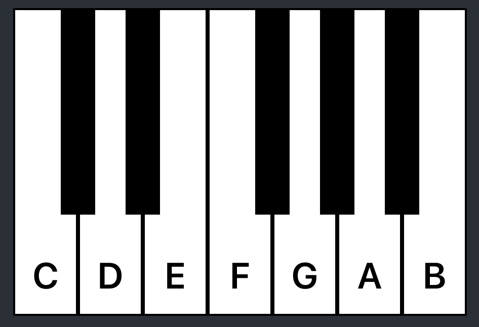

# Piano Application
___

___

## Descripton:
Application create using React (Classes). It waas test task for employer

___

## Control

z: 'c'

s: 'df'

x: 'd'

d: 'ef'

c: 'e'

v: 'f'

g: 'gf'

b: 'g'

h: 'af'

n: 'a'

j: 'bf'

m: 'b'

## Available Scripts

### `npm start`

Runs the app in the development mode.